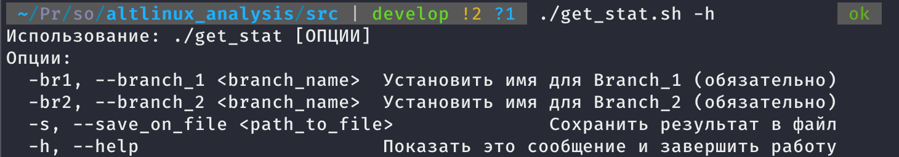

<div align="center">
    
  </a>

<h3 align="center">Altlinux Analysis</h3>

  <p align="center">
    Analyze actual packages
  </p>
</div>


<details>
  <summary>Navigation</summary>
  <ol>
    <li>
      <a href="#about-the-project">About The Project</a>
      <ul>
        <li><a href="#built-with">Built With</a></li>
      </ul>
    </li>
    <li>
      <a href="#getting-started">Getting Started</a>
      <ul>
        <li><a href="#installation">Installation</a></li>
      </ul>
    </li>
    <li><a href="#usage">Usage</a></li>
    <li><a href="#contributing">Contributing</a></li>
    <li><a href="#license">License</a></li>
    <li><a href="#contact">Contact</a></li>
  </ol>
</details>


<!-- ABOUT THE PROJECT -->
## About The Project


	


This allows you to keep track of the status of your packages in various branches and for different architectures.


### Built With

* 
* 
* 


<!-- GETTING STARTED -->
## Getting Started

This is an example of how to set up your project on your local machine. To get a local copy running, follow these simple steps.


### Installation


1. Clone the repo
   ```sh
   git clone https://github.com/Korliore/altlinux_analysis.git
   cd altlinux_analysis
   ```
3. Install dependencies
   ```sh
   pip install -r requirements.txt 
   ```


<!-- USAGE EXAMPLES -->
## Usage
### For use utility go to src directory

For watch all usable arguments in utility use the following command
```sh
./get_stat.sh -h
   ```
<br/>


<br/>

For exaple:
```sh
./get_stat.sh -br1 p10 -br2 p9
   ```
Result of this command will compare packages in p10 and p9 branches and print the json in console

If you want to save the json in a file use the -s and filename parameters
```sh
./get_stat.sh -br1 p10 -br2 p9 -s result.json
   ``` 

<!-- CONTRIBUTING -->
## Contributing

Contributions are what make the open source community such an amazing place to learn, inspire, and create. Any contributions you make are **greatly appreciated**.

If you have a suggestion that would make this better, please fork the repo and create a pull request. You can also simply open an issue with the tag "enhancement".
Don't forget to give the project a star! Thanks again!

1. Fork the Project
2. Create your Feature Branch (`git checkout -b feature/AmazingFeature`)
3. Commit your Changes (`git commit -m 'Add some AmazingFeature'`)
4. Push to the Branch (`git push origin feature/AmazingFeature`)
5. Open a Pull Request


<!-- LICENSE -->
## License

Distributed under the MIT License. See `LICENSE` for more information.


<!-- CONTACT -->
## Contact

Nikita - [Telegram](t.me/korliore)

Project Link: [https://github.com/Korliore/altlinux_analysis](https://github.com/Korliore/altlinux_analysis)


